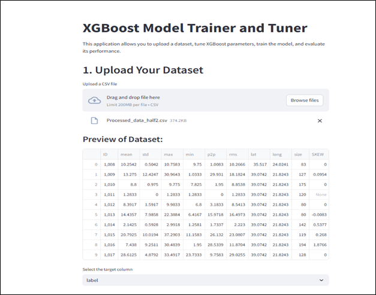
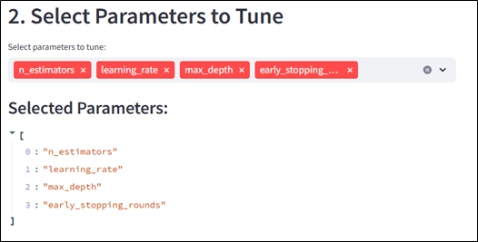
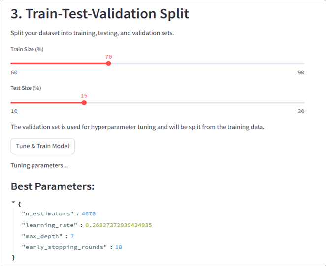
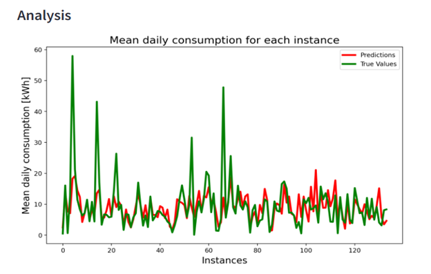
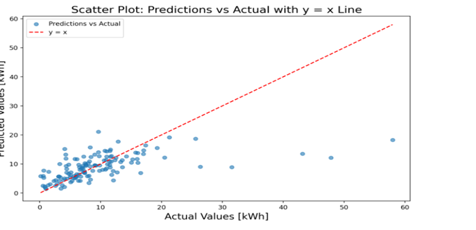

# Local model Training 

## Table of contents
* Project Overview
* AI pipeline
  * `Feature extraction.ipynb`
  * `XGBoost_model_evaluating.ipynb`
* User Interface
  * `app.py`
  * `model.py`
  * `tuner.py`
  * UI demo
* Dependencies

## Project Overiview
This repository contains indludes the code, files and data for two main tasks: 
-- **AI Model development** for Mean Energy Consumption prediction
-- **User Interface development** for training and evaluating the model by a user.

### AI model development
Regarding this task, two main Jupyter Notebook files are related to machine learning pipeline development: 
`Feature_extraction.ipynb` and `XGBoost_model_evaluating.ipynb`.These notebooks demonstrate feature extraction processes and model evaluation techniques using XGBoost.

#### -> `Feature_extraction.ipynb`
This notebook focuses on data preprocessing and feature extraction. It includes the following steps:
* Reading and exploring raw data.
* Cleaning and transforming data.
* Generating statistical, categorical, or domain-specific features.
* Visualizing feature distributions using matplotlib and seaborn.

#### -> `XGBoost_model_evaluating.ipynb`
This notebook evaluates machine learning models using the XGBoost library. It includes:
* Loading preprocessed feature data.
* Splitting data into training and testing sets.
* Training XGBoost models with hyperparameter tuning.
* Evaluating model performance using metrics such as accuracy, F1 score, and AUC.
* Visualizing evaluation results, such as confusion matrices and feature importances.

**HOW TO RUN:** To run the model, install the `requirements.txt` and activate the virtual enivironment.

### User Interface
For this task, there is a **ui** file in the repo which contains python files related to the application building. To run the application, 
you have to run the **`app.py`** file.

#### ->`app.py`
This is the main file which runs the application. It includes the logic and the stling of the application and calls the tuner and model classes from `tuner.py` and `model.py`

#### ->`tuner.py`
This file contains the tuning class

#### ->`model.py`
In this file the class of the model development is built.

**HOW TO RUN:** After installing the `requirements.txt` and activate the virtual enivironment, type to your terminal: `streamlit run app.py`.

#### UI demo

#### Upload a dataset - select target column

#### Select hyperparameters for model tuning

#### Train - Test split

#### Model evaluation

